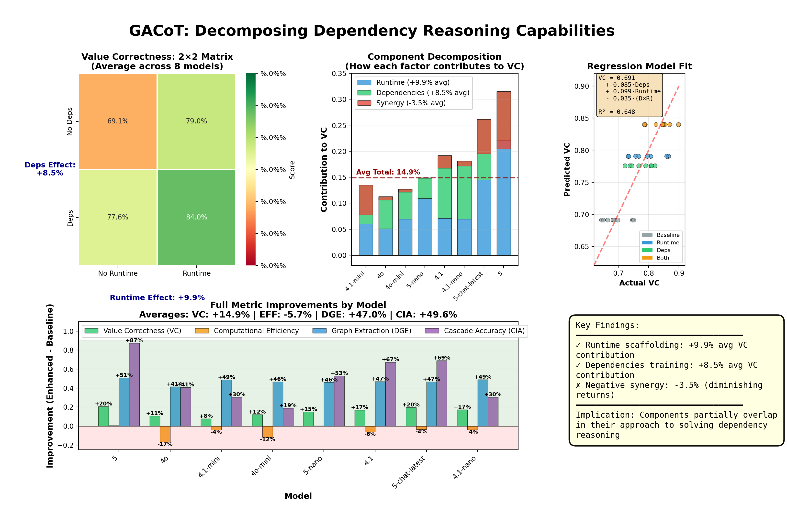

# GACoT: Graph-Augmented Chain of Thought for Financial Reasoning

A framework to improve LLM accuracy on financial calculations through dependency tracking and runtime scaffolding.

## Key Finding

**Value Correctness improves from 69.1% to 84.0% (+14.9%)** when augmenting LLMs with dependency graphs and runtime tracking across 8 frontier models.

This improvement correlates with explicit dependency handling, suggesting that financial reasoning benefits from structured tracking - though we measure correlation, not proven causation.




## The Problem

LLMs struggle with multi-step financial calculations that require dependency management:
1. Calculate metric A (depends on B and C)
2. Update input B
3. Model may not recalculate A

This breaks core financial workflows like sensitivity analysis, waterfalls, and model updates.

## Approach

We test dependency reasoning, across Personal Finance, M&A and Investment Analysis domains, through a 2×2 experimental design that isolates two interventions:

### 1. Dependencies in Dataset
When enabled, we augment prompts with explicit dependency graphs:
"
Dependency structure:
total_cost depends on: labor_cost, material_cost
profit depends on: revenue, total_cost
"

### 2. Runtime Tracking Instructions  
When enabled, we add explicit instructions for dependency management:
"
IMPORTANT: Track and explicitly state all calculation dependencies.
When any value changes, identify all variables that need recalculation.
"

We find:
### The 2×2 Matrix in Practice

| Condition | What Model Receives | Value Correctness |
|-----------|-------------------|------------------|
| Baseline | Problem only | 69.1% |
| +Dependencies | Problem + dependency graph | 74.2% |
| +Runtime | Problem + tracking instructions | 78.5% |
| +Both | Problem + graph + instructions | 84.0% |


Regression: `VC = 0.691 + 0.085*Deps + 0.099*Runtime - 0.035*(Deps*Runtime)`
Each intervention adds ~8-10% accuracy independently, with slight interference when combined (-3.5%).

Both factors contribute independently, with slight diminishing returns when combined.

## Results

Tested on GPT-4, GPT-4o and GPT-5 families:

- **Primary**: Value Correctness 69.1% → 84.0% (what actually matters)
- **Exploratory**: Dependency extraction (45% → 78%), Cascade awareness (0.5% → 50%) - but metrics are brittle

Efficiency decreases as expected - runtime tracking adds legitimate computational overhead.

## Why This Matters

Financial models are dependency graphs. Every DCF, merger model, and portfolio optimization relies on cascading calculations. Current LLMs break these workflows, limiting their use in general finance, investment banking, private equity, and quantitative finance. GACoT demonstrates that structured scaffolding can partially address this gap.

## Metrics & Limitations

**Critical caveat**: Current metrics measure surface-level patterns, not true understanding. Only Value Correctness directly measures capability.

- **Value Correctness (VC)**: Numerical accuracy within tolerance - our only ground-truth metric
- **Dependency Graph Extraction (DGE)**: Detects dependency language/notation (correlational)
- **Cascade Identification (CIA)**: Format-dependent co-occurrence check (exploratory only)
- **Efficiency**: Token usage (expected to decrease with scaffolding)

We observe correlation between dependency tracking and accuracy but cannot prove causation from this evaluation alone.

## Quick Start

```bash
# Install
git clone https://github.com/jh5123/gacot.git
cd gacot && pip install -e ".[viz]"

# Run evaluation
cp .env.example .env  # Add OpenAI key
python evaluate.py --model gpt-4o-mini gpt-4  # Uses cache
python evaluate.py --force-api --model gpt-4o-mini  # Fresh run

# View results
python evaluate.py --aggregate gpt-4o-mini gpt-4
# See results/gacot_one_page_showcase.html
```

License:
MIT

Third party credit:
Dataset source: FinChain (https://arxiv.org/pdf/2506.02515)
We augmented it with explicit dependency graphs for controlled testing.
